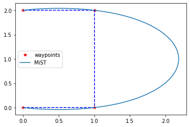

# MiSTGen: Minimum Snap Trajectory Generator

## 1 Overview

Minimum snap trajectory generators can generate smooth trajectories that have minimum snap， pass through specified waypoints and are subject to velocity and acceleration constraints.



## 2 How to use

### 3.1 Installing

```shell
pip install mistgen
```

### 3.2 Usage

```python
from mistgen.mist import mist_generator

myMistGen = mist_generator()

xxs,yys,tts = myMistGen.mist_2d_gen(waypts_ori,v0,a0,ve,ae,T)
vaj_xy = myMistGen.mist_2d_vaj_gen(xxs,yys,tts)
myMistGen.mist_2d_vis(waypts_ori,xxs,yys,tts,vaj_xy,show_wp=True,show_mist_xy=True,show_avj=True,same_plot=False)

# or all in one:
mistTraj = myMistGen.mist_2d_gen_all(waypts_ori,v0,a0,ve,ae,T,show_wp=True,show_mist_xy=True,show_avj=False,same_plot=False)
```

A simple example: 

```python
def main_demo_v010():
	ax = [0.0, 5.0,5.0,0.0]
    ay = [0.0, 0.0,6.0,6.0]
    
    waypts_ori = np.array([ax,ay])
    
    T = 10
    v0 = np.array([0,0])
    a0 = np.array([0,0])
    ve = np.array([0,0])
    ae = np.array([0,0])
    
    myMistGen = mist_generator()
    xxs,yys,tts = myMistGen.mist_2d_gen(waypts_ori,v0,a0,ve,ae,T)
    vaj_xy = myMistGen.mist_2d_vaj_gen(xxs,yys,tts)
    myMistGen.mist_2d_vis(waypts_ori,xxs,yys,tts,vaj_xy,True,True,True)
    yaw_rad,yaw_deg = myMistGen.calc_yaw(vaj_xy[0],vaj_xy[3])
```

For more example, please do the following:

```python
from mistgen.examples.main_demo_v010 import main_demo_v010
from mistgen.examples.main_demo_v02x import main_demo_v020
from mistgen.examples.main_demo_v02x import main_demo_v021
```

## 3 API

Some utils functions:

```python
from utils.T_functions import arrangeT
from utils.T_functions import init_T
from utils.cvxopt_qp import quadprog
from utils.other_utils import computeQ
from utils.other_utils import calc_tvec
from utils.other_utils import re_shape_vaj
from utils.other_utils import poly_val
```

## License

This source code is released under `GNU GENERAL PUBLIC LICENSE Version 3` license.

For more questions, please contact author: Zhaoliang (zhz03@g.ucla.edu)

## Reference

[1] Minimum Snap Trajectory Generation and Control for Quadrotors

